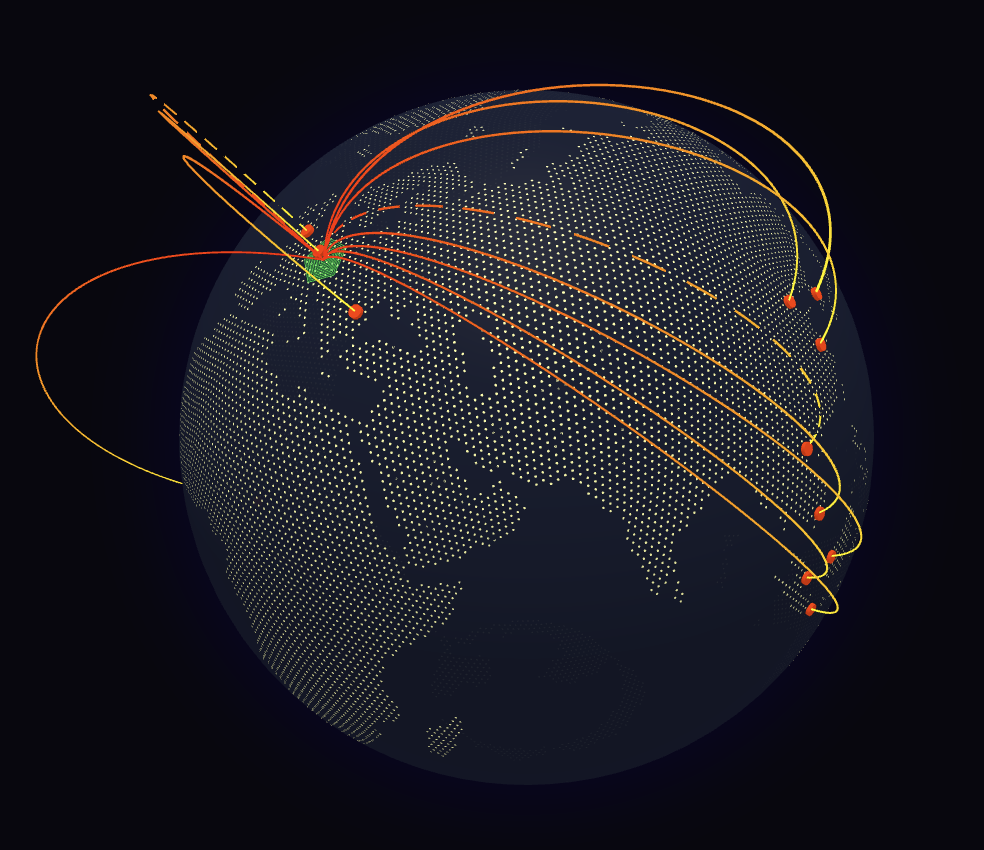

# Authlog Map

A simple project for learning purposes about different kind of topics: docker, docker compose, use docker in develop & watch mode, auth.log and access logs on linux, react-globe.gl, websockets on backend with hono and client side using a react hook and deployment pipeline for ci/cd of applications.

## Example screenshot

